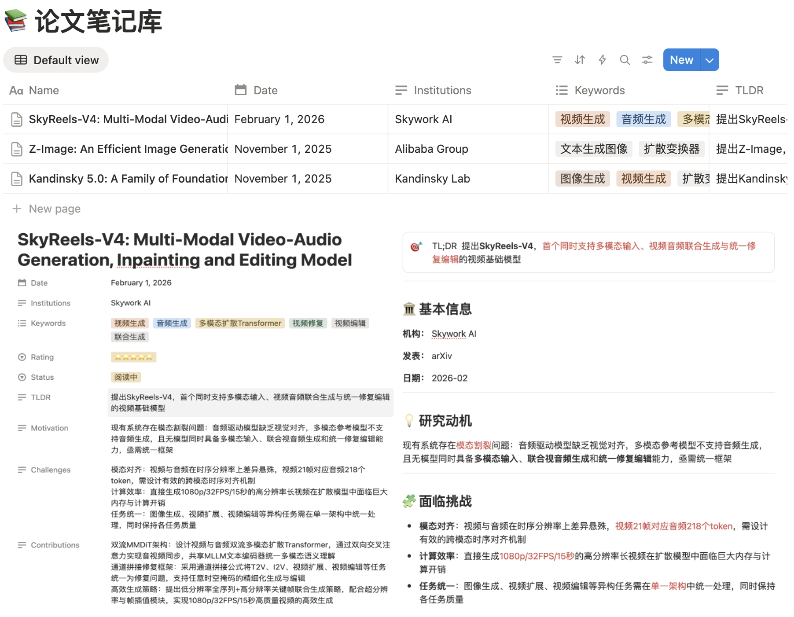

# 📚 Scribe


自动将 PDF 学术论文解析为结构化 Notion 笔记。

使用 **Claude CLI** 阅读并分析论文全文，提取标题、动机、核心贡献、方法创新、实验结果等关键信息，自动在 Notion 数据库中创建排版精美的笔记页面

---

## 效果预览



每篇论文生成一个 Notion 页面，包含：

- 🎯 **TL;DR** — 一句话核心总结
- 💡 **研究动机** — 解决什么问题
- 🧩 **面临挑战** — 技术难点列表
- 🚀 **核心创新方案** — 3 条最关键贡献
- 🗄️ **数据创新** / ⚙️ **方法创新** — 分层呈现
- 📐 **评估方法** / 📊 **实验结果** / 🏁 **结论**
- ⚖️ **优缺点评价** — 客观三优三劣
- 📝 **备注** — 进一步研究方向

---

## 文件结构

```
Scribe/
├── pdf_to_notion.py        # 单文件处理：PDF 解析 + Notion 页面创建
├── batch_pdf_to_notion.py  # 批量处理：扫描目录、断点续处理
├── setup_notion_db.py      # 一键初始化 Notion 数据库结构
├── requirements.txt        # Python 依赖
├── .env.example            # 环境变量模板
└── .gitignore
```

---

## 快速开始

### 1. 安装依赖

```bash
pip install -r requirements.txt
```

> 同时需要安装并登录 [Claude Code CLI](https://docs.anthropic.com/claude-code)，本项目通过 `claude -p` 调用 Claude 分析论文。

### 2. 配置环境变量

```bash
cp .env.example .env
```

编辑 `.env`，填入以下三项：

```env
ANTHROPIC_API_KEY=your_anthropic_api_key_here
NOTION_API_KEY=your_notion_integration_token_here
NOTION_DATABASE_ID=your_notion_database_id_here
```

| 变量 | 获取方式 |
|------|----------|
| `ANTHROPIC_API_KEY` | [console.anthropic.com](https://console.anthropic.com/) |
| `NOTION_API_KEY` | [notion.so/my-integrations](https://www.notion.so/my-integrations) → 新建 Integration → 复制 Token |
| `NOTION_DATABASE_ID` | 见下方说明 |

### 3. 准备 Notion 数据库

**方式 A：自动创建（推荐）**

在 Notion 中新建一个空白页面，从 URL 获取其 Page ID，然后运行：

```bash
python setup_notion_db.py --parent-page-id YOUR_PAGE_ID
```

脚本会自动创建带完整字段的数据库，并输出 `NOTION_DATABASE_ID` 填入 `.env`。

**方式 B：使用已有数据库**

从数据库页面 URL 中复制 32 位 ID 填入 `.env`。建议数据库至少包含 `Name`（标题）字段，其余字段脚本会自动跳过未匹配的部分。

**最后**，在 Notion 数据库页面点击右上角 `...` → `Connections`，添加你创建的 Integration，授权访问。

---

## 使用方法

### 处理单个 PDF

```bash
python pdf_to_notion.py paper.pdf
python pdf_to_notion.py paper1.pdf paper2.pdf paper3.pdf
```

### 批量处理目录

```bash
# 处理目录下所有 PDF
python batch_pdf_to_notion.py /path/to/papers

# 递归扫描子目录
python batch_pdf_to_notion.py /path/to/papers --recursive

# 重新处理上次失败的文件
python batch_pdf_to_notion.py /path/to/papers --retry-failed

# 强制重新处理所有文件（忽略进度记录）
python batch_pdf_to_notion.py /path/to/papers --force

# 预览待处理列表，不实际执行
python batch_pdf_to_notion.py /path/to/papers --dry-run

# 调整处理间隔（默认 2 秒，避免 API 限速）
python batch_pdf_to_notion.py /path/to/papers --delay 3
```

批量处理会在目录下生成 `.batch_progress.json` 记录进度，已成功的文件下次自动跳过。

---

## Notion 数据库字段说明

| 字段 | 类型 | 说明 |
|------|------|------|
| Name | Title | 论文标题 |
| Keywords | Multi-select | 关键词标签 |
| Date | Date | 发表日期 |
| Institutions | Text | 作者机构 |
| TLDR | Text | 一句话总结 |
| Motivation | Text | 研究动机 |
| Challenges | Text | 技术挑战 |
| Contributions | Text | 核心贡献 |
| Data Innovations | Text | 数据创新 |
| Methods | Text | 方法创新 |
| Evaluation | Text | 评估方法 |
| Results | Text | 实验结果 |
| Conclusion | Text | 论文结论 |
| Strengths | Text | 优点 |
| Weaknesses | Text | 局限 |

> 数据库中不存在的字段会自动跳过，不会报错。

---

## 依赖

- [anthropic](https://pypi.org/project/anthropic/) — Anthropic Python SDK
- [notion-client](https://pypi.org/project/notion-client/) — Notion API 客户端
- [python-dotenv](https://pypi.org/project/python-dotenv/) — 环境变量管理
- [pypdf](https://pypi.org/project/pypdf/) — PDF 文字提取
- [Claude Code CLI](https://docs.anthropic.com/claude-code) — 论文分析引擎

---

## License

MIT
